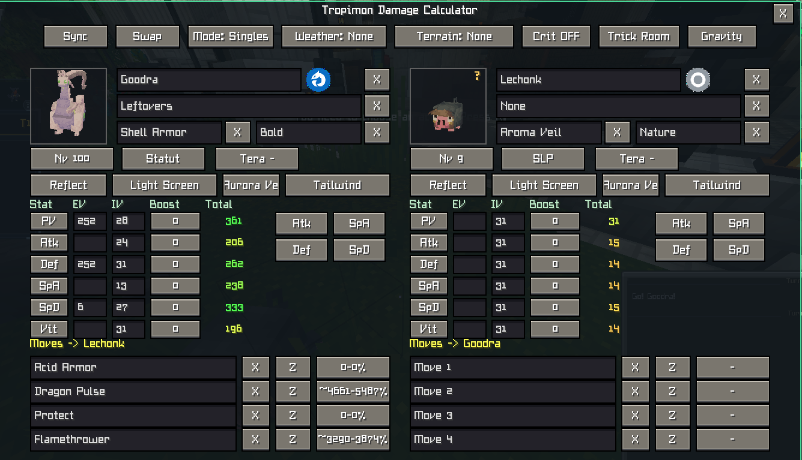
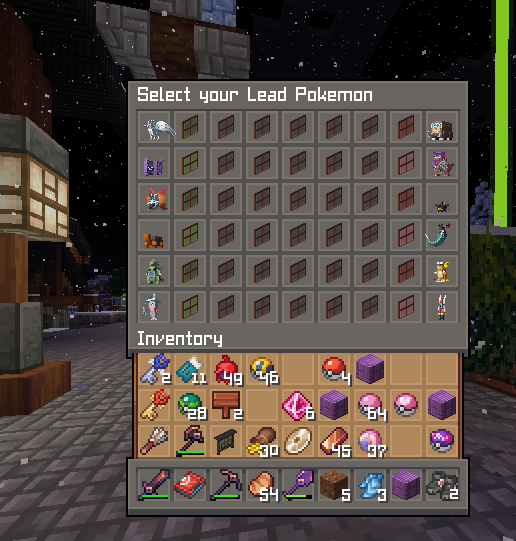

# Tropimon Damage Calculator - Guide complet

Tropimon Damage Calculator est un calculateur de dégâts **entièrement intégré à Minecraft** pour Cobblemon. Il compare les attaques de deux Pokémon, lit les données disponibles dans le jeu et met le calcul à jour au fil du combat.

Le mod est uniquement côté client. Il ne joue aucun tour, ne modifie pas le combat et ne révèle pas les informations privées de l'adversaire.

## Source des données

Le catalogue est construit depuis le contenu Cobblemon installé :

- espèces, formes régionales, formes alternatives et Mega ;
- statistiques de base, types et talents autorisés par forme ;
- attaques et objets ;
- modèles 3D et icônes de type ;
- noms et descriptions dans la langue active du jeu.

Le mod n'utilise ni API Pokémon externe ni base de données distante. Les datapacks et extensions exposés comme du contenu Cobblemon peuvent donc aussi être découverts par le catalogue.

## Ouvrir le calculateur

Trois méthodes sont disponibles :

1. Appuyer sur la touche configurée. La valeur par défaut d'une nouvelle installation est `B`.
2. Exécuter la commande client `/tropicalc`.
3. En combat, utiliser le bouton `Calc` intégré à l'interface Cobblemon.

La touche se modifie dans `Options > Contrôles > Assignation des touches > Tropimon Damage Calculator`. Minecraft conserve une assignation déjà personnalisée lors des mises à jour.

Quand le calculateur est ouvert depuis un combat, la croix en haut à droite ramène à l'interface de combat Cobblemon.

## Utilisation rapide

1. Choisir un Pokémon dans chaque champ de recherche.
2. Choisir jusqu'à quatre attaques de chaque côté.
3. Ajuster le niveau, les EV, IV, boosts, objets, talents, natures et statuts.
4. Régler le mode, la météo, le terrain et les protections.
5. Lire la fourchette de dégâts affichée en face de chaque attaque.

Il suffit de cliquer sur une proposition : il n'est pas nécessaire de saisir le nom complet. Les listes sont triées par ordre alphabétique et filtrées pendant la saisie.

## Automatisations

| Événement | Informations récupérées ou mises à jour | Effet dans le calculateur |
| --- | --- | --- |
| Chargement du jeu | Contenu Cobblemon installé, formes, attaques, objets, talents, modèles et traductions | Construction du catalogue sans service externe |
| Sélection d'un Pokémon | Forme, types, stats de base, attaques proposées et talents légaux | Le panneau et les calculs sont actualisés immédiatement |
| Sélection d'une forme Mega | Forme Mega et Mega-Gemme correspondante | La gemme est équipée automatiquement quand elle existe dans Cobblemon |
| Import de l'équipe du joueur | Espèce et forme exactes, niveau, PV, objet, talent, nature, EV, IV et attaques | Le set privé du joueur est prérempli depuis le client |
| Team Preview compatible | Composition visible de l'équipe adverse | Les Pokémon sont proposés à droite avant leur entrée en jeu |
| Entrée ou changement de Pokémon | Pokémon actif, forme, niveau, PV actuels, statut et boosts visibles | Les deux côtés sont resynchronisés sans rouvrir l'écran |
| Attaque utilisée | Nom de l'attaque et utilisateur | Une attaque adverse révélée est ajoutée au set, dans la limite de quatre |
| Objet ou talent révélé | Objet tenu, objet consommé/perdu, talent activé | La valeur connue remplace l'inconnue et le calcul est relancé |
| Modification de stats | Hausses, baisses, remise à zéro et inversion des boosts | Les stages d'Attaque, Défense, Attaque Spéciale, Défense Spéciale et Vitesse sont appliqués |
| Météo | Pluie, Soleil, Tempête de sable, Neige ou fin de météo | Les attaques, talents et statistiques concernés sont recalculés |
| Terrain | Électrik, Herbu, Brumeux, Psychique ou fin du terrain | Les bonus, réductions et attaques dépendantes du terrain sont appliqués |
| Protection de côté | Reflect, Light Screen, Aurora Veil et Tailwind | La réduction de dégâts ou la Vitesse effective est appliquée au bon côté |
| Combat Duo | Nombre de cibles, partenaire actif, Helping Hand, Wide Guard et talents de partenaire visibles | Les attaques de zone et modificateurs Duo utilisent le contexte réel |
| Transformation visible | Mega, Aegislash, Minior, Wishiwashi, Palafin, Meloetta et autres changements exposés par Cobblemon | La forme active et ses statistiques remplacent la forme précédente |
| Nouveau tour | Effets temporaires et historique du tour | Les effets à durée courte sont nettoyés et les chaînes sont poursuivies |
| Fermeture ou nouveau combat | Contexte et historique du combat précédent | Les données temporaires ne contaminent pas le combat suivant |

Le bouton `Sync` force une nouvelle lecture des informations visibles si l'état affiché semble en retard.

## Équipe et Team Preview

Les entrées marquées comme appartenant à l'équipe du joueur contiennent les informations privées disponibles côté client. Leur sélection remplit le set complet, y compris la forme exacte, les EV, IV, nature, talent, objet et attaques.

Pendant un Team Preview compatible, le mod enregistre les espèces et formes montrées par Cobblemon. Il déduplique ensuite cette liste avec les Pokémon réellement envoyés au combat.

Pour l'adversaire, seules les informations légitimement visibles sont enregistrées. Un objet, talent ou mouvement inconnu reste inconnu jusqu'à sa révélation ou sa saisie manuelle.

## Random Battle Tropimon

Le calculateur active sa logique Random Battle uniquement lorsqu'il reconnaît ce format. La détection combine le message de file d'attente, le format déclaré par le combat et la présence d'une équipe générée de six Pokémon qui ne correspond pas à l'équipe persistante du joueur. Les autres combats ne reçoivent aucune déduction de set Random Battle.

Les sets sont lus en priorité depuis les fichiers Tropimon présents dans l'installation du jeu, notamment `tropimon-random-battle-sets.json`, `tropimon-random-battle-sets` ou `tropimon.json`. Le fichier préféré est contrôlé toutes les cinq secondes et rechargé lorsqu'il change. Si aucun fichier local compatible n'est disponible, la version actuelle peut utiliser le snapshot Tropimon inclus dans le JAR.

Pour chaque Pokémon Random Battle, le mod compare les variantes disponibles avec les informations déjà connues :

- niveau réel du Pokémon ;
- objet et talent lorsqu'ils sont visibles ;
- type Tera connu ;
- attaques déjà révélées ;
- espèce et forme exactes.

Les variantes incompatibles sont retirées progressivement. Une information n'est préremplie automatiquement que si elle est commune à toutes les variantes restantes. Quand une seule variante reste, le set complet peut être appliqué. Si plusieurs variantes restent possibles, un bouton `Set N` apparaît : `Set 1` est chargé dès l'ouverture et chaque clic passe au set suivant. Le survol affiche le contenu de la variante. Les sets strictement identiques sont fusionnés pendant le chargement.

L'équipe Random Battle du joueur est récupérée depuis l'acteur de combat Cobblemon afin de conserver ses formes, niveaux, EV, IV, nature, talent, objet et attaques. Si les six EV sont encore absents au début du combat, le calculateur utilise `85 EV` partout comme valeur Random Battle de secours ; il ne remplace jamais une répartition live dès qu'au moins une valeur est disponible. Tous les adversaires reçoivent la même répartition d'EV que le Pokémon du joueur et une nature `Serious`, y compris lorsqu'ils viennent d'un Team Preview déjà résolu. Le calculateur affine ensuite objet, talent, Tera et attaques avec les variantes Tropimon et les révélations du combat.

Le Team Preview Random Battle est capturé aussi bien depuis les informations de bataille structurées que depuis l'inventaire de sélection du lead. Les Pokémon sont dédupliqués, les formes sont réconciliées avec la forme réellement envoyée et les révélations sont conservées pendant le combat.

## Synchronisation en combat

Le calculateur suit les messages structurés et l'état de combat Cobblemon. Cette lecture ne dépend pas du texte anglais affiché dans le chat : elle continue donc de fonctionner lorsque le jeu est en français.

Les événements suivis comprennent notamment :

- les attaques utilisées, ratées ou sans effet ;
- les changements de stats, Belly Drum, Anger Point et les remises à zéro ;
- les statuts visibles, dont la brûlure et sa réduction des dégâts physiques ;
- les changements de Pokémon et de forme ;
- la météo, les terrains et les protections de côté ;
- Helping Hand, Wide Guard, Flash Fire, Protosynthesis et Quark Drive ;
- le nombre de coups reçus, les alliés K.O. et les chaînes d'attaques dépendantes des tours précédents.

Toute modification du contexte déclenche un nouveau calcul des attaques affichées. Le bouton `Swap` échange les deux sets complets, y compris Pokémon, forme, objet, talent, nature, statistiques, attaques et conditions de côté.

## Calculs pris en charge

Le moteur tient compte des éléments suivants :

- niveau, statistiques, EV, IV, nature, boosts et statut ;
- types, STAB, Tera, efficacité, coup critique et valeurs aléatoires ;
- talents et objets modifiant une statistique, la puissance ou les dégâts ;
- météo, terrain, Reflect, Light Screen, Aurora Veil et Tailwind ;
- Solo et Duo, avec pénalité des attaques de zone lorsqu'elles touchent plusieurs cibles ;
- Helping Hand, Friend Guard, Wide Guard et talent du partenaire lorsque l'information est disponible ;
- attaques multi-coups, Skill Link, Loaded Dice et précision par coup ;
- Triple Axel, Triple Kick, Population Bomb et Parental Bond ;
- puissance variable selon les PV, la Vitesse, le poids, le statut ou les boosts ;
- historique de Rage Fist, Last Respects, Fury Cutter, Rollout, Ice Ball, Echoed Voice, Retaliate et effets similaires ;
- probabilités de K.O., Focus Sash, Sturdy, Disguise et Ice Face ;
- Z-Moves proposés par le contenu disponible et activables avec le bouton `Z`.

Un bouton `Z` actif reste vert et remplace le nom affiché par celui du Z-Move correspondant. Un second clic le désactive.

## Interface

- **Cadre Tropimon** : panneau Cobblemon agrandi en neuf zones, avec fond sombre semi-transparent et contenu contenu dans les deux colonnes.
- **Portraits** : modèles Cobblemon animés, placés dans de petits cadres cyan avec une marge régulière.
- **Pokémon, objet, talent et nature** : champs recherchables appliqués au clic.
- **X** : retire rapidement la valeur sélectionnée.
- **Niveau** : choix rapide des niveaux courants, dont 5, 50 et 100.
- **EV / IV / Boost** : chaque statistique reste éditable séparément.
- **Atk / SpA / Def / SpD** : répartitions EV rapides.
- **Statut** : applique le statut sélectionné au calcul.
- **Tera** : choisit le type Téracristal.
- **Reflect / Light Screen / Aurora Veil / Tailwind** : conditions propres à chaque côté ; un bouton actif devient vert.
- **Mode** : passe de Solo à Duo et adapte les contrôles disponibles.
- **Météo / Terrain / Crit** : conditions globales du calcul.
- **X d'une attaque** : vide uniquement cet emplacement d'attaque.
- **Pourcentage de dégâts** : fourchette des dégâts par rapport aux PV maximaux de la cible.
- **Croix supérieure droite** : ferme l'écran, devient rouge au survol et restaure l'interface Cobblemon si un combat est toujours actif.

Les couleurs des statistiques donnent un repère visuel allant du rouge pour une valeur faible au vert pour une valeur élevée. Elles restent indicatives et suivent la statistique finale au niveau sélectionné.

Les en-têtes `Stat`, `EV`, `IV`, `Boost` et `Total` sont centrés sur leurs colonnes. Les boutons de presets EV sont volontairement compacts afin de laisser davantage de place aux valeurs et aux attaques.

## Ce qui reste manuel

Le mod ne peut pas connaître une information que le client Cobblemon n'a pas reçue. Il faut donc parfois renseigner manuellement :

- les EV, IV et la nature d'un adversaire ;
- un objet, talent ou mouvement adverse encore caché ;
- un effet de datapack qui n'expose pas d'événement compatible ;
- Friend Guard lorsque le partenaire concerné n'est pas représenté dans l'état actif ;
- un historique commencé avant la connexion ou avant le chargement du mod.

Les valeurs manuelles restent utiles pour tester plusieurs hypothèses de set sans modifier le combat.

## Dépannage

### `/tropicalc` ne s'ouvre pas

Vérifiez que la version la plus récente du JAR est installée, puis redémarrez complètement Minecraft. Remplacer le JAR pendant que le jeu tourne ne recharge pas le mod.

### La touche ouvre un autre mod

Modifiez l'assignation dans les contrôles Minecraft. La touche par défaut `B` n'écrase pas une ancienne configuration enregistrée.

### Une information de combat manque

Utilisez `Sync`, puis vérifiez que l'information a réellement été révélée par Cobblemon. La commande `/tropicalc debug` écrit des diagnostics utiles dans le journal du client.

### Une forme n'est pas correcte

Sélectionnez l'entrée portant le nom complet de la forme. En combat, un changement exposé par Cobblemon doit ensuite remplacer automatiquement la forme précédente.

## Compatibilité

- Minecraft 1.21.1
- Fabric Loader 0.16 ou plus récent
- Fabric API
- Cobblemon 1.7.2
- Java 21

Tropimon Damage Calculator est un projet indépendant et non officiel.
